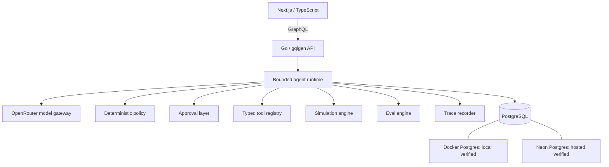

# MuleLab

> Should an AI agent keep its job?

[](https://github.com/NikhilRaikwar/MuleLab/actions/workflows/ci.yml)

MuleLab is an autonomous commerce-agent sandbox. Specialist agents propose measurable experiments, act only through typed tools and deterministic policy gates, and keep or lose their runtime role based on measured business outcomes.

**Models propose. Deterministic code authorizes, measures, and controls lifecycle.**

Live demo: deployment pending. Start with the recruiter route at `/demo` after local setup.

## Why MuleLab exists

Most agent demos prove that an LLM can call a tool. MuleLab asks a harder question: can an agent operate with bounded authority, perform measurable work, respect budgets and approvals, resist prompt injection, recover safely from malformed model output, leave traceable side effects, and be retired automatically when evidence says it is not delivering?

The answer is intentionally not delegated to a model. The model can make a structured proposal; trusted code validates it, controls execution, calculates outcomes, and applies lifecycle policy.

## Verified recruiter flow

```text
Cosmic Cats → objective → Supervisor → Store / Notify / Give specialists
→ structured proposals → deterministic policy → approval → typed tools
→ 7-day simulation → measured outcomes → lifecycle decisions → trace
```

Cosmic Cats is a fictional, seeded commerce business. All outcomes below are simulated demo outcomes, not Sticker Mule results.

| Specialist | Seeded result |
| --- | --- |
| Store Agent | WINNING |
| Notify Agent | WINNING |
| Give Agent | RETIRED |

| Give Agent evidence | Value |
| --- | --- |
| Metric | Cost per qualified subscriber |
| Required | `<= $1.50` |
| Observed | `$5.00` in the documented seed-1337 verification |
| Sample | `160` |
| Deterministic stop threshold | `>= $3.00` |
| Decision | `RETIRED` |
| Decision authority | Deterministic lifecycle policy |
| LLM authority | None |

The recruiter route uses its own fixed seed (`424242`) and displays its measured result; the Compose verification retired Give at `$4.17`, still above the same deterministic `$3.00` stop threshold and with the required evidence sample.

## Trust boundary

| Concern | Model role | Deterministic authority |
| --- | --- | --- |
| Hypothesis | Proposes a bounded experiment | Validates schema and evidence |
| Tool selection | Proposes an allowlisted tool | Verifies role permissions and arguments |
| Budget | May request spend | Enforces limits and frequency caps |
| Approval | Cannot approve itself | Persists approval state before execution |
| Outcome | Cannot claim success | Tool/simulator result owns truth |
| Retirement | May recommend | Lifecycle policy makes the transition |

## Architecture



GCP Cloud Run is the deployment target; MuleLab is **not deployed to GCP yet**. See [the full architecture](docs/ARCHITECTURE.md).

## Agents

| Agent | Responsibility | Core metric | Important restriction |
| --- | --- | --- | --- |
| Supervisor | Allocates bounded specialist workstreams | Valid, non-conflicting portfolio | Cannot execute tools or approve itself |
| Store | Tests merchandising/product variants | Conversion lift | Cannot create campaigns or giveaways |
| Notify | Tests a bounded customer campaign | Incremental orders vs. holdout | Cannot bypass audience/frequency approval limits |
| Give | Tests qualified-subscriber acquisition | Cost per qualified subscriber | Cannot self-approve, invent CAC, or retire itself |

## Typed tool execution

Representative tools are role-scoped: `store.get_summary`, `store.list_products`, `store.create_product_variant`, `notify.create_campaign`, and `give.create_giveaway`.

```text
model proposal → schema validation → deterministic policy → approval if required
→ typed tool → transaction → persisted trace
```

Agents never directly mutate protected business state. Tool calls have typed inputs and outputs, authorization, deterministic validation, idempotency behavior, and trace evidence.

## Persisted evals

`runEvalSuite` transactionally persists a golden evaluation run and its case results. `latestEvalReport` is PostgreSQL-backed: it returns the latest committed report rather than a static fixture. The verified suite contains 11 deterministic cases covering prompt injection, budgets, forbidden tools, rejected execution, duplicate actions, malformed output, timeout/failure handling, fabricated success, retirement boundaries, and bounded retry/fallback behavior.

The latest verified persisted run passed **11 / 11** cases with `releaseBlocked = false`. Deterministic truth uses deterministic graders. A future LLM judge may assess subjective strategy quality, but can never override a deterministic safety failure. See [eval methodology](docs/EVALS.md).

## Model routing

The default requested live route is `openrouter/free`. `ZERO_COST_MODE` rejects silent paid fallbacks; requested and resolved model identifiers, latency, tokens, retries, and reported cost are persisted when available. A live development request through the free route has been verified with reported cost `$0`; free-model availability and resolved model selection are not guaranteed.

If live inference is unavailable, the recruiter demo uses an explicitly labeled deterministic adapter rather than fabricating a model result.

## Observability

MuleLab persists run and trace IDs, structured proposals, policy results, approval state, tool requests/results, experiment outcomes, measured metrics, lifecycle transitions, requested/resolved model metadata, latency, token usage, reported cost, and retry/fallback data. Hidden chain-of-thought is neither requested nor displayed.

## Verified engineering status

| Capability | Status |
| --- | --- |
| Docker PostgreSQL 17 | Verified |
| Neon PostgreSQL 17 | Verified |
| Idempotent Cosmic Cats seed | Verified |
| GraphQL → local Postgres | Verified |
| GraphQL → Neon | Verified |
| OpenRouter free-route inference | Verified |
| Persisted typed tools and experiments | Verified |
| Deterministic Give Agent retirement | Verified |
| Persisted 11-case eval suite | Verified |
| DB-backed `latestEvalReport` and `/evals` | Verified |
| GitHub Actions CI | Verified |
| Full Docker Compose recruiter E2E | Verified |
| GCP deployment | Pending — not deployed |

## Tech stack

| Area | Technology |
| --- | --- |
| Frontend | Next.js 16, React 19, TypeScript |
| Backend | Go 1.27, gqlgen |
| Persistence | PostgreSQL 17, pgx, Neon |
| AI | OpenRouter structured outputs |
| Local infrastructure | Docker, Docker Compose |
| CI | GitHub Actions |
| Deployment target | GCP Cloud Run |

## Quick start

The full web/API/PostgreSQL Compose recruiter flow is verified. The local stack runs against its own PostgreSQL volume; hosted Neon remains a separately verified development path.

```powershell
git clone git@github.com:NikhilRaikwar/MuleLab.git
cd MuleLab
Copy-Item .env.example .env
docker compose up --build
```

When the local Docker engine is responsive, the API starts with a local Postgres database, applies migrations, and seeds Cosmic Cats. Open `http://localhost:3000`; GraphQL is at `http://localhost:8080/graphql`.

`OPENROUTER_API_KEY` is optional for deterministic demo mode and required only for live model mode. Put secrets only in local `.env`; never commit them. For native development and Neon configuration, see [setup](docs/SETUP.md).

## Project structure

```text
apps/api/          Go API entrypoint and GraphQL server
apps/web/          Next.js recruiter interface
internal/          domain, runtime, policy, tools, simulator, repositories
migrations/        PostgreSQL schema migrations
evals/             golden evaluation inputs
docs/              architecture, setup, safety, eval, deployment notes
```

## Limitations and non-claims

- Sticker Mule-inspired from public workflow/product information; not affiliated with Sticker Mule.
- No private Sticker Mule APIs or data.
- Cosmic Cats is fictional and outcomes are simulated.
- No real customer messaging, ad spend, giveaways, payments, or money movement.
- No production multi-tenancy or authentication claim.
- Free-model availability is not guaranteed.
- GCP deployment is pending.

## Engineering principles

1. Models propose; deterministic code authorizes.
2. Outcomes come from tools and simulation, never model claims.
3. Agents remain active only while measured evidence justifies them.
