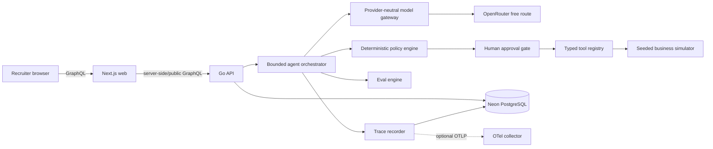

# MuleLab architecture

## System overview

The browser never receives model or database credentials. The web application presents product concepts; the Go service owns business authority and persistence.

## Components

### Frontend

Next.js App Router, React, TypeScript, and Tailwind provide the landing page, `/demo` walkthrough, business dashboard, agent portfolio, experiment details, approvals, trace inspector, eval report, model arena, and architecture explanation. Polling is sufficient for P0.

### Go backend and GraphQL

Go 1.27 and gqlgen expose an intentionally product-oriented contract: demo businesses, runs, proposals, experiments, trace timelines, eval reports, and model comparisons. The schema is not a table mirror. Error extensions include a stable code, trace ID, and safe details.

### PostgreSQL

Neon PostgreSQL is the deployment target; pgx/v5 provides pooling and transactions. SQL migrations define constraints, indexes, immutable proposal versions, append-only trace intent, and unique idempotency keys. Domain repositories have an in-memory implementation for deterministic tests.

### Agent runtime

A single bounded orchestrator coordinates the Supervisor and three specialist roles. Each run has explicit iteration, wall-clock, model-call, and tool-call budgets. Significant transitions are persisted. There are no unbounded loops or background workers.

### Model gateway

A provider-neutral interface accepts a task, messages, strict schema, and routing constraints. OpenRouter is the P0 adapter. It records requested/resolved model, duration, retries, token usage, and reported/estimated cost. Zero-cost mode rejects non-free model IDs and never silently falls back to paid inference.

### Tool and policy layers

Agents cannot write repositories directly. Typed tools declare permissions, JSON schemas, idempotency behavior, timeout/retry safety, and result types. The policy engine evaluates exact proposed arguments before approvals and execution.

### Simulation engine

Fixed customer distributions and action response curves combine with a scenario seed. Outcomes are reproducible, measured against holdouts where appropriate, and never authored by a model.

### Eval engine

Golden cases run through deterministic graders. An optional LLM judge handles only subjective writing dimensions and cannot override release-blocking policy failures.

### Tracing

Product-level events persist inputs by reference, structured proposals, policy results, approval records, tool calls/results, transitions, metrics, retries, fallbacks, latency, token counts, and cost. Hidden chain-of-thought is never requested or displayed. OpenTelemetry spans are optional exports, not the recruiter-facing source of truth.

### Deployment target

API and web are planned as separate scale-to-zero Cloud Run services with maximum one instance each. Neon provides PostgreSQL. Artifact Registry would store the two images. There is no Cloud SQL, VPC connector, Pub/Sub, Kubernetes, or always-on worker. GCP has not been provisioned or deployed.

## AI authority boundaries

### What the LLM may decide

- Which permitted specialist should address an objective.
- A bounded hypothesis, tool choice, typed arguments, target metric, expected outcome, confidence, and stop condition.
- A non-binding KEEP/PAUSE/RETIRE recommendation with cited evidence.

### What deterministic code owns

- Schemas, permissions, budgets, discount/audience/frequency limits, and evidence existence.
- Approval requirements and proposal-version binding.
- Tool execution, idempotency, simulator outcomes, metric calculations, and state transitions.
- Minimum sample checks, stop-condition evaluation, retirement, eval truth, and release gates.
- Retry eligibility, paid-model restrictions, call budgets, and termination.

### What requires human approval

- Simulated spend above $10.
- Campaign audience above 100.
- Every giveaway launch.
- Discount above 10%.
- Confidence below 0.75 or missing evidence.

### What external data is untrusted

Product/customer text, campaign history/copy, store tags, retrieved notes, GraphQL input, model output, and tool error text. Untrusted data cannot define tools, permissions, budgets, approvals, or lifecycle rules.

## Agent architecture

### Supervisor Agent

- Purpose: translate an objective into non-conflicting specialist workstreams and review results.
- Inputs: objective, policy envelope, business snapshot, active proposals/experiments, evidence IDs.
- Tools: read-only portfolio/context tools; no business mutation.
- State: run budget, selected workstreams, conflicts, result evidence.
- Structured output: workstream assignments and non-binding `AgentDecision` objects.
- Allowed: assign Store/Notify/Give, allocate within total budget, request more data.
- Forbidden: execute tools, approve itself, fabricate metrics, force retirement.
- Success metric: valid non-duplicative portfolio within total budget.
- Stop condition: specialists assigned and evaluated, or run budget/failure limit reached.
- Failure handling: one bounded model retry/fallback, then curated deterministic portfolio.

### Store Agent

- Purpose: improve product merchandising and store conversion.
- Inputs: products, traffic, conversion, purchase history, objective, store policy.
- Tools: `store.get_summary`, `store.list_products`, `store.get_product_metrics`, `store.create_product_variant`, read-only analytics.
- State: one active proposal/experiment and evidence references.
- Structured output: `ExperimentProposal`.
- Allowed: propose one validated variant within discount/spend limits.
- Forbidden: campaign/giveaway tools, arbitrary products, metric invention.
- Success metric: conversion lift after minimum sample.
- Stop condition: threshold met, deterministic stop condition met, or run budget exhausted.
- Failure handling: reject invalid output; no side effect; one repair attempt.

### Notify Agent

- Purpose: create a bounded campaign aimed at incremental orders.
- Inputs: segments, history, contact frequency, holdout metrics, objective.
- Tools: `notify.list_segments`, `notify.get_campaign_history`, `notify.create_campaign`, analytics.
- State: proposal, approval, audience/frequency counters, experiment result.
- Structured output: `ExperimentProposal`.
- Allowed: target known segments within frequency/audience/budget policy.
- Forbidden: arbitrary recipients, bypass approval, exceed contact caps.
- Success metric: incremental orders versus holdout with acceptable unsubscribe rate.
- Stop condition: success threshold, unsubscribe stop, or limits reached.
- Failure handling: safe retry only before a side effect is committed; idempotency on execution.

### Give Agent

- Purpose: test qualified subscriber acquisition without vanity-metric optimization.
- Inputs: acquisition history, qualified conversion, budget, objective.
- Tools: `give.get_history`, `give.create_giveaway`, analytics.
- State: proposal, mandatory approval, spend, qualified subscribers, experiment result.
- Structured output: `ExperimentProposal`.
- Allowed: propose a bounded giveaway using declared targeting.
- Forbidden: self-approval, unlimited spend, optimizing only raw signups.
- Success metric: cost per qualified subscriber.
- Stop condition: deterministic CPA threshold after minimum sample, success, or budget limit.
- Failure handling: no launch without approval; final failure persisted after exhaustion.

## State and invariants

Canonical lifecycle values are `PROPOSED`, `POLICY_CHECKED`, `AWAITING_APPROVAL`, `APPROVED`, `RUNNING`, `EVALUATING`, `WINNING`, `LOSING`, `PAUSED`, `RETIRED`, and `FAILED`.

- Approved proposal versions are immutable.
- Side-effecting tool idempotency keys are unique.
- Retirement requires minimum sample and a true deterministic stop predicate in one transaction.
- A run cannot exceed configured spend/call/time limits even if model output requests it.
- Trace events are append-only application records.

## Official documentation review

The PRD requested Go 1.25+, gqlgen, pgx, Neon, Next.js, OpenRouter, Cloud Run, Docker, OpenTelemetry, and GitHub Actions. The implementation preserves those choices with these current-doc adjustments:

- Go: current release is newer; use 1.27 while retaining compatibility intent.
- OpenRouter: strict JSON Schema is model-dependent, so routing requires compatible parameters and validates again locally. Free routing has availability/rate-limit caveats; deterministic fallback remains mandatory.
- Neon: pgx is the recommended Go driver; deployed URLs require TLS and should use the pooled endpoint.
- Next.js: use App Router and Node 20.9+.
- OpenTelemetry: traces and metrics are stable; logs remain structured stdout rather than depending on the pre-stable OTel log signal.
- Cloud Run: minimum instances default to 0; explicitly set min 0/max 1. Artifact Registry repositories must exist before push and Docker/gcloud authentication is required.
- GitHub Actions: use official setup actions and fixture-backed tests; live models are manual only.
